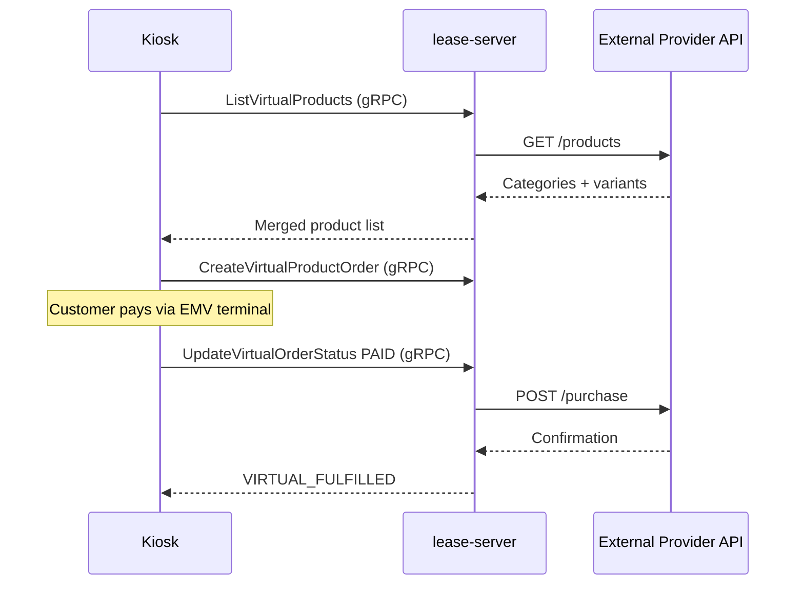

# Virtual Product External API Protocol

**Version:** 1.0
**Jira:** [SD-3708](https://vendingontrack.atlassian.net/browse/SD-3708)

This document defines the HTTP API contract that a 3rd-party provider must implement to integrate virtual products with the Vending on Track kiosk platform.

---

## Overview

The lease-server acts as a gateway between kiosks and the external provider. The provider serves a product catalog and processes purchases; the lease-server handles payment collection, caching, and kiosk communication.



---

## Authentication

All endpoints require the `X-API-Key` HTTP header.

| Header       | Type   | Required | Description                          |
|--------------|--------|----------|--------------------------------------|
| `X-API-Key`  | string | Yes      | API key provisioned for this merchant |

Requests with a missing or invalid key **must** return `401 Unauthorized`.

---

## Endpoints

### `GET /ping`

Health check and credential verification. Called by the merchant admin portal when configuring the integration.

**Request:**
```
GET /ping HTTP/1.1
Host: api.provider.example.com
X-API-Key: <api-key>
```

**Response — 200 OK:**
```json
{
  "status": "ok"
}
```

**Error responses:**

| Status | Condition            |
|--------|----------------------|
| 401    | Invalid or missing API key |
| 500    | Internal server error      |

---

### `GET /products`

Returns the full product catalog grouped by categories. Each category contains one or more purchasable variants.

**Request:**
```
GET /products HTTP/1.1
Host: api.provider.example.com
X-API-Key: <api-key>
```

**Response — 200 OK:**
```json
{
  "categories": [
    {
      "id": "green-fees",
      "name": "Green Fees",
      "description": "Access to championship golf course",
      "image_url": "https://cdn.example.com/golf.jpg",
      "variants": [
        {
          "sku": "GOLF-18-WD",
          "name": "18-Hole Weekday",
          "description": "Valid Monday-Friday before 3pm",
          "price_in_cents": 4500
        },
        {
          "sku": "GOLF-9-WD",
          "name": "9-Hole Weekday",
          "description": "Valid Monday-Friday",
          "price_in_cents": 2500
        }
      ]
    }
  ]
}
```

#### Category object

| Field         | Type   | Required | Description                                 |
|---------------|--------|----------|---------------------------------------------|
| `id`          | string | Yes      | Stable identifier for this category         |
| `name`        | string | Yes      | Display name shown on kiosk                 |
| `description` | string | No       | Short description of the category           |
| `image_url`   | string | No       | HTTPS URL to a category image               |
| `variants`    | array  | Yes      | List of purchasable variants (min 1 to show)|

#### Variant object

| Field             | Type    | Required | Description                                            |
|-------------------|---------|----------|--------------------------------------------------------|
| `sku`             | string  | Yes      | Unique stock-keeping unit code (unique across **all** categories) |
| `name`            | string  | Yes      | Display name shown on kiosk                            |
| `description`     | string  | No       | Optional detail (e.g. validity period)                 |
| `price_in_cents`  | integer | Yes      | Price in the merchant's currency, in cents (no floats) |

#### Rules

- `sku` **must** be unique across all categories for this API key / merchant.
- `price_in_cents` **must** be a non-negative integer.
- Categories with an empty `variants` array are ignored by the server.
- Response **must** return within **500 ms**. The server enforces a hard timeout; slow responses cause a fallback to cache or an empty product list.

---

### `POST /purchase`

Confirms a purchase after the customer has successfully paid at the kiosk. Called exactly once per transaction (with retries using the same `transaction_id`).

**Request:**
```
POST /purchase HTTP/1.1
Host: api.provider.example.com
X-API-Key: <api-key>
Content-Type: application/json

{
  "sku": "GOLF-18-WD",
  "customer_identifier": "+61412345678",
  "transaction_id": "LEASE-NG-abc123",
  "amount_paid_in_cents": 4500
}
```

#### Request body

| Field                  | Type    | Required | Description                                                  |
|------------------------|---------|----------|--------------------------------------------------------------|
| `sku`                  | string  | Yes      | Variant SKU from the `/products` catalog                     |
| `customer_identifier`  | string  | Yes      | Customer phone number (e.g. `+61412345678`) or venue code    |
| `transaction_id`       | string  | Yes      | Unique, server-generated ID — acts as **idempotency key**    |
| `amount_paid_in_cents` | integer | Yes      | Amount the customer paid, in cents                           |

**Response — success (200 OK):**
```json
{
  "confirmation_id": "BOOK-789456",
  "status": "confirmed",
  "message": "Your tee time is confirmed"
}
```

**Response — failure (200 OK):**
```json
{
  "confirmation_id": "",
  "status": "failed",
  "message": "No tee times available"
}
```

#### Response body

| Field             | Type   | Required | Description                                              |
|-------------------|--------|----------|----------------------------------------------------------|
| `confirmation_id` | string | Yes      | Provider's booking/confirmation reference (empty on failure) |
| `status`          | string | Yes      | `"confirmed"` or `"failed"`                              |
| `message`         | string | Yes      | Human-readable message shown to the customer on the kiosk |

#### Rules

- **Idempotency:** Repeated requests with the same `transaction_id` **must** return the same result. The server may retry up to 3 times on transient failures.
- **Timeout:** Response **must** arrive within **20 seconds**. If the server does not receive a response in time, it triggers an automatic refund to the customer.
- `status` **must** be exactly `"confirmed"` or `"failed"`. Any other value is treated as a failure.
- A non-2xx HTTP status code is treated as a failure and triggers an automatic refund.

---

## Error Handling Summary

| Scenario                    | HTTP Status | Server Behavior                                   |
|-----------------------------|-------------|---------------------------------------------------|
| Invalid/missing API key     | 401         | Kiosk sees empty product list (list) or refund (purchase) |
| `/products` timeout (>500ms)| —           | Server uses cached catalog if available (<10 min old), else empty list |
| `/products` 5xx error       | 500         | Same as timeout — cache fallback or empty list     |
| `/purchase` timeout (>20s)  | —           | Order marked VIRTUAL_FULFILLMENT_FAILURE, auto-refund |
| `/purchase` non-2xx         | 4xx/5xx     | Order marked VIRTUAL_FULFILLMENT_FAILURE, auto-refund |
| `/purchase` status "failed" | 200         | Order marked VIRTUAL_FULFILLMENT_FAILURE, auto-refund |

---

## Caching Behavior

The lease-server caches the `/products` response as a **fallback only**:

1. Every `ListVirtualProducts` call attempts the external API first.
2. On success, the cache is refreshed.
3. On failure or timeout, the server falls back to cached data **only if** the cache is less than 10 minutes old.
4. If the cache is older than 10 minutes or empty, virtual products are hidden (empty list returned to kiosk).
5. A background timer refreshes the cache every 10 minutes to keep the fallback warm.

Providers do **not** need to implement caching — just respond quickly and consistently.

---

## Mock Server (Reference Implementation)

This repository contains a Python/FastAPI mock server that implements the full protocol. Use it for development, testing, and as a reference when building a production provider.

### Running

```bash
pip install -r requirements.txt
python main.py                        # default: golf preset on :8099
python main.py examples/tennis.json   # tennis preset
```

### Configuration

| Variable            | Default            | Description                                     |
|---------------------|--------------------|-------------------------------------------------|
| `API_KEY`           | `test-api-key`     | Expected `X-API-Key` value                      |
| `DATA_FILE`         | `examples/golf.json` | Path to product data JSON file                |
| `PORT`              | `8099`             | Listen port                                     |
| `RESPONSE_DELAY_MS` | `0`                | Artificial delay in ms (for timeout testing)    |
| `FAIL_PURCHASE`     | `false`            | When `true`, `POST /purchase` always fails      |

### Example Data Files

Two presets are included in the `examples/` directory:

**`golf.json`** — a golf club with one category:
- Green Fees: 18-Hole Weekday ($45), 9-Hole Weekday ($25), 18-Hole Weekend ($55)

**`tennis.json`** — a tennis venue with two categories:
- Court Booking: Court A ($30), Court B ($30), Court C ($35)
- Lessons: 30-min Private ($50), 60-min Group ($25)

Custom data files follow the same JSON schema as the `GET /products` response.

### Docker

```bash
docker build -t virtual-product-mock .
docker run -p 8099:8099 -e API_KEY=my-key virtual-product-mock
```
